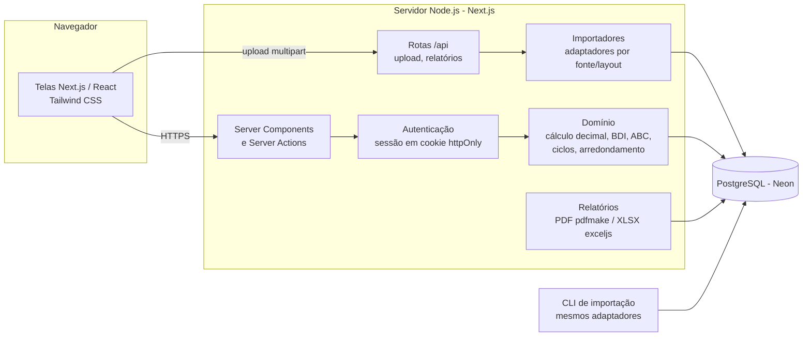
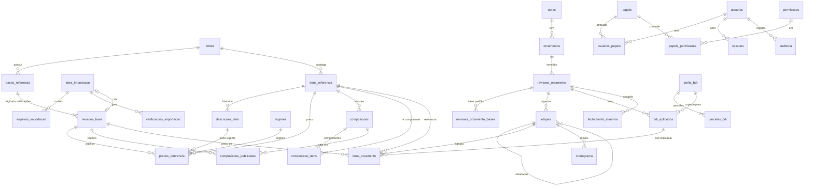

# Sistema Web de Orçamento de Obras — EMOP-RJ e SINAPI-RJ

## Planejamento técnico (versão 1 — outubro/2026)

Este documento responde aos 7 itens pedidos na seção 12 do escopo, **antes** da programação.
Ele foi escrito depois de inspecionar os arquivos oficiais reais enviados:

- `EMOP_012026.rar` (boletim EMOP de janeiro/2026: DBF, XLS, XLSX, PDFs e DOCX)
- `SINAPI-2026-01-formato-xlsx_Retificacao01.zip` (SINAPI janeiro/2026, Retificação 01)

As conclusões sobre layouts **não são suposições**: foram verificadas registro a registro nesses arquivos
(ver seção 4 e `docs/LAYOUTS_OFICIAIS.md`).

## Situação da implementação (outubro/2026)

As 6 etapas foram implementadas e validadas com testes automatizados (unitários e de integração com
PostgreSQL) e com os arquivos oficiais completos de jan/2026, importados pelo navegador numa simulação fiel
da imagem de produção. Ajustes em relação ao plano abaixo, decididos durante a implementação:

- `revisoes_base` não tem status `RASCUNHO`: o lote fica no staging até a confirmação; a revisão nasce
  `VALIDADA`. Revisão rejeitada tem seus preços apagados para liberar espaço (o relatório do lote fica).
- Chave de `precos_referencia` = (item, revisão, regime): um só índice atende busca e histórico.
- Tabela extra de staging `stg_atributos` (% de mão de obra do SINAPI).
- Primeiro administrador e dados iniciais criados automaticamente na inicialização (variáveis
  `ADMIN_*`), para dispensar o uso de terminal.
- Hospedagem recomendada confirmada: Render (Docker) + Neon; memória medida em produção simulada:
  pico de ~360 MB na importação completa EMOP + SINAPI.

---

## 1. Arquitetura recomendada



| Camada | Escolha | Justificativa |
|---|---|---|
| Aplicação web | **Next.js 15 (App Router) + TypeScript** | Um único projeto para telas e backend; credenciais ficam só no servidor. |
| Interface | **Tailwind CSS 4** | Interface limpa sem dependência de kit visual pesado. |
| Banco | **PostgreSQL 16 no Neon** | Pedido do escopo; plano gratuito; `NUMERIC` exato. |
| Acesso a dados | **Prisma ORM 6** + SQL puro nas cargas em lote | Prisma para CRUD tipado com `Decimal`; SQL (`UNNEST` em lotes) para importar dezenas de milhares de linhas rapidamente. As migrações são **arquivos SQL escritos à mão** (aplicados com `prisma migrate deploy`) para podermos usar gatilhos, índices parciais e `pg_trgm`. |
| Decimais | **decimal.js** (o mesmo usado pelo Prisma) | Nenhum cálculo financeiro usa `number` de ponto flutuante. |
| DBF | **Leitor próprio** (≈150 linhas, testado) | As bibliotecas de DBF convertem campos numéricos em `number` (perde exatidão). O leitor próprio entrega o texto original do campo, que é convertido para `Decimal` sem perda, e lê registro a registro (streaming). |
| XLSX (importação) | **Leitor SAX próprio sobre `yauzl` + `saxes`** | O SINAPI grava os códigos de composição só dentro de fórmulas `HYPERLINK` (valor em cache = 0) e os preços como texto decimal no XML. Lendo o XML diretamente: (a) extraímos o código da fórmula, (b) mantemos o decimal exato, (c) processamos 22 MB de XML por aba em fluxo, sem carregar a planilha inteira na memória. |
| ZIP / RAR | **yauzl** (ZIP, streaming) e **node-unrar-js** (RAR, WebAssembly) | A EMOP publica em RAR; o SINAPI em ZIP. |
| Relatórios | **pdfmake** (PDF) e **exceljs** (XLSX) | Bibliotecas maduras, servidor-side, tabelas com cabeçalho repetido. |
| Senhas | **Argon2id** (`@node-rs/argon2`) | Algoritmo recomendado pela OWASP. |
| Testes | **Vitest** (unidade e integração com PostgreSQL real) | Rápido; os testes de integração usam um banco PostgreSQL de teste. |

**Organização do código** (`orcamentos/`):

```
prisma/            schema.prisma + migrations/ (SQL) + seed
src/app/           telas (App Router) e rotas /api
src/dominio/       regras puras: dinheiro, BDI, arredondamento, orçamento, ABC, ciclos
src/importacao/    leitores (dbf, xlsx, zip, rar), detecção de assinatura,
                   adaptadores/emop-dbf-v1, adaptadores/sinapi-xlsx-2025, staging, publicação
src/relatorios/    montagem dos dados + renderizadores PDF/XLSX
src/servidor/      autenticação, permissões, auditoria, acesso a dados
tests/             unitários, integração e amostras reais reduzidas (fixtures)
scripts/           CLI de importação, backup/restauração
```

---

## 2. Modelo completo do banco PostgreSQL

O DDL completo e autoritativo está em `prisma/migrations/*/migration.sql`. Resumo por grupo:

Convenções: identificadores internos `uuid` (`gen_random_uuid()`); códigos oficiais `text` (preserva zeros à
esquerda, pontos, hífens e letras); valores `numeric` (nunca `float`); datas de competência `date` no dia 1;
nomes de tabelas e colunas em português, `snake_case`.
Tabelas associativas de alto volume (preços e componentes) usam **chave primária composta de UUIDs**,
evitando um UUID extra por linha (economia de espaço no plano gratuito).

### 2.1 Fontes, bases e importação

| Tabela | Finalidade | Campos principais |
|---|---|---|
| `fontes` | EMOP, SINAPI, PROPRIA | `id`, `sigla` (único), `nome` |
| `regimes` | Regimes de encargos | `codigo` (PK texto: `SEM_DESONERACAO`, `COM_DESONERACAO`, `SEM_ENCARGOS`), `nome` |
| `bases_referencia` | Base mensal lógica | `id`, `fonte_id`, `uf`, `competencia` — único (fonte, uf, competência) |
| `revisoes_base` | Publicação original e retificações | `id`, `base_id`, `numero`, `rotulo` ("Original", "Retificação 01"), `status` (`RASCUNHO`→`VALIDADA`→`PUBLICADA`/`REJEITADA`/`SUBSTITUIDA`), `data_emissao`, `regimes` (texto[]), `publicada_em/por`, `lote_id`. Índice único parcial: só **uma** revisão `PUBLICADA` por base. |
| `lotes_importacao` | Execução do assistente | `id`, `fonte_id`, `uf`, `competencia`, `regimes`, `adaptador`, `importador_versao`, `status` (`ANALISADO`, `IMPORTADO`, `FALHOU`, `CANCELADO`), `contagens` jsonb, `erro`, `duplicidade_justificativa`, datas, usuário |
| `arquivos_importacao` | Cada arquivo original | `id`, `lote_id`, `nome`, `caminho_no_pacote`, `tamanho`, `sha256`, `assinatura` (DBF/XLSX/ZIP/RAR), `layout`, `papel` (ex.: `EMOP_PRECOS_SERVICOS`) |
| `verificacoes_importacao` | Relatório de inconsistências | `id`, `lote_id`, `regra`, `severidade` (`ERRO`/`AVISO`/`INFO`), `mensagem`, `arquivo`, `linha`, `codigo`, `detalhes` jsonb |
| `stg_itens`, `stg_precos`, `stg_componentes` | **Staging** (tabelas `UNLOGGED`) | dados brutos do lote, linha de origem e valor textual original; apagados após confirmação |

### 2.2 Catálogo, preços e composições

| Tabela | Finalidade | Campos principais |
|---|---|---|
| `itens_referencia` | Insumos, composições/serviços | `id`, `fonte_id`, `tipo` (`INSUMO`/`COMPOSICAO`), `codigo`, `descricao` e `unidade` (última versão, para busca), `classe` (ex.: MATERIAL, MAO DE OBRA, REUTILIZADA), `grupo`, `regime_codigo` (EMOP: definido pelo dígito final), `codigo_composicao_vinculada` (EMOP REUT) — único (fonte, tipo, código) |
| `descricoes_item` | Histórico de descrição/unidade | `id`, `item_id`, `descricao`, `unidade`, `hash` — único (item, hash) |
| `precos_referencia` | Preço histórico | PK (`revisao_base_id`, `regime_codigo`, `item_id`); `descricao_id`, `preco` numeric NULL, `situacao` (`INFORMADO`, `AUSENTE`, `SEM_CUSTO`, `SEM_PRECO`), `origem_preco` (C/CR), `percentual_as`, `percentual_mao_obra`, `linha_origem` |
| `composicoes` | **Versões** de composição (imutáveis) | `id`, `item_id`, `origem` (`OFICIAL`/`PROPRIA`), `hash_conteudo`, `primeira_revisao_base_id`, `criada_em` — único (item, hash) |
| `composicao_itens` | Componentes e coeficientes | PK (`composicao_id`, `ordem`); `sequencia` (EMOP), `tipo_item`, `item_id`, `codigo_original`, `coeficiente` numeric(24,10), `percentual_perda` (EMOP), `situacao_origem` (SINAPI), `custo_unitario_informado` (só próprias) |
| `composicoes_publicadas` | Qual versão vale em cada revisão | PK (`revisao_base_id`, `item_id`), `composicao_id`, `situacao` |
| `manutencoes_sinapi` | Relatório de manutenções | `revisao_base_id`, `referencia`, `tipo`, `codigo`, `descricao`, `manutencao` |

Versionamento: ao importar fevereiro, uma composição cujos componentes não mudaram reaproveita a mesma
versão (mesmo `hash_conteudo`). Isso reduz o armazenamento mensal de ~160 mil linhas para apenas as alterações.

### 2.3 Composições próprias

Item da fonte `PROPRIA` + versões em `composicoes` (`origem = PROPRIA`). Cada componente aponta para um item
de referência (EMOP/SINAPI/próprio) **e** para a revisão de base de onde vem o preço
(`composicao_itens.revisao_base_id`, `regime_codigo`), ou tem `custo_unitario_informado` (insumo próprio).
Antes de salvar uma versão, o sistema verifica **referências circulares** (busca em profundidade no grafo).
Composições oficiais nunca podem ser editadas; "copiar para própria" gera um item novo da fonte PROPRIA,
identificado como tal em todas as telas e relatórios.

### 2.4 Orçamentos

| Tabela | Finalidade | Campos principais |
|---|---|---|
| `obras` | Empreendimento | `id`, `nome`, `cliente`, `municipio`, `uf`, `endereco`, `descricao` |
| `orcamentos` | Orçamento de uma obra | `id`, `obra_id`, `codigo`, `nome`, `descricao` |
| `revisoes_orcamento` | Versões do orçamento | `id`, `orcamento_id`, `numero`, `status` (`ABERTA`/`FECHADA`), `descricao`, `versao` (**controle de concorrência otimista**), `modo_arredondamento` (`TRUNCAR`/`ARREDONDAR`), `revisao_origem_id`, `bdi_padrao_id`, totais congelados, `fechada_em/por`, `hash_fechamento` |
| `revisoes_orcamento_bases` | Base padrão por fonte | PK (`revisao_id`, `fonte_id`), `revisao_base_id`, `regime_codigo` |
| `etapas` | Etapas e subetapas (árvore) | `id`, `revisao_id`, `pai_id`, `ordem`, `titulo` |
| `itens_orcamento` | Linhas do orçamento | `id`, `revisao_id`, `etapa_id`, `ordem`, `tipo` (`REFERENCIA`/`PROPRIO`), `item_referencia_id`, `revisao_base_id`, `regime_codigo`, `composicao_id`, **instantâneo**: `fonte_sigla`, `competencia`, `rotulo_revisao_base`, `codigo`, `descricao`, `unidade`, `custo_unitario`; `quantidade`, `bdi_aplicado_id` (individual, opcional), `bdi_percentual`, `preco_unitario`, `total`, `observacao` |
| `cronograma` | Físico-financeiro | PK (`etapa_id`, `mes`), `percentual` |
| `fechamento_insumos` | Explosão analítica congelada no fechamento | `revisao_id`, `item_orcamento_id`, `ordem`, `nivel`, `codigo`, `descricao`, `unidade`, `coeficiente_acumulado`, `custo_unitario`, `fonte`, `revisao_base_id` |

### 2.5 BDI

| Tabela | Finalidade |
|---|---|
| `perfis_bdi` | Perfis reutilizáveis (ex.: "EMOP 13ª ed. — Edifícios — sem desoneração — até R$ 150 mil"), `percentual_adotado`, `fonte_documento` |
| `parcelas_bdi` | AC, S, R, G, DF, L, tributos (PIS, COFINS, ISS, CPRB), com `percentual` |
| `bdi_aplicados` | **Cópia congelada** do perfil usado em uma revisão de orçamento (parcelas em jsonb + percentual calculado + percentual adotado) |

Fórmula (Acórdão TCU 2622/2013, adotada pela EMOP no Catálogo de Referência, item 2.3):
`BDI = (1+AC+S+R+G)·(1+DF)·(1+L) / (1−T) − 1`.

### 2.6 Usuários, permissões e auditoria

`usuarios` (e-mail único, hash Argon2id, `ativo`, bloqueio por tentativas), `papeis`, `permissoes`,
`papeis_permissoes`, `usuarios_papeis`, `sessoes` (somente o **hash SHA-256** do token é guardado),
`auditoria` (somente inserção — gatilho bloqueia `UPDATE`/`DELETE`).

### 2.7 Regras garantidas pelo próprio banco (gatilhos)

1. Itens, etapas, cronograma e bases padrão de uma revisão **FECHADA** não podem ser inseridos, alterados ou
   excluídos (protege contra alterações retroativas mesmo se houver falha no código da aplicação).
2. Preços, componentes e composições publicadas de uma revisão de base `PUBLICADA` ou `SUBSTITUIDA` são imutáveis.
3. Itens de orçamento só podem apontar para revisões de base `PUBLICADA` ou `SUBSTITUIDA` (nunca rascunho).
4. `auditoria` é somente-inserção.

---

## 3. Diagrama entidade-relacionamento



---

## 4. Estratégia de importação dos arquivos reais

### 4.1 Fluxo do assistente (10 passos do escopo)

1. **Fonte** (EMOP ou SINAPI) → 2. **Competência** (sugerida pelo nome do arquivo e conferida com o conteúdo:
   `MMYY` nos DBF da EMOP; "Mês de Referência: 01/2026" nas abas SINAPI) → 3. **Regimes** (SINAPI: sem
   desoneração, com desoneração, sem encargos; EMOP: os dois regimes vêm no mesmo arquivo) → 4. **Upload**
   (RAR, ZIP, DBF ou XLSX; gravação em disco temporário com SHA-256 calculado em fluxo) →
   5. **Identificação do layout pela assinatura binária e pelos campos**, nunca pela extensão (os `.xls` da EMOP
   são DBF) → 6. **Validação** → 7. **Pré-visualização** → 8. **Confirmação** → 9. **Gravação em uma única
   transação** → 10. **Relatório de inconsistências**. Depois, um usuário com permissão **publica** a revisão
   (só então ela aparece para novos orçamentos).

### 4.2 EMOP — adaptador `emop-dbf-v1` (verificado em jan/2026)

| Arquivo | Registros | Uso |
|---|---:|---|
| `EMOPmmaa.dbf` | 22.270 | `CODIGO`, `PRECO` — preço oficial do serviço |
| `DIPRmmaa.dbf` | 22.270 | `CODIGO`, `DESCR1..6`, `UNID`, `CUSTO` — descrição e custo |
| `COMPmmaa.dbf` | 103.386 | `CODIGO`, `SEQUENCIA`, `ELEMENTAR`, `QUANTIDADE`, `PERCENTUAL` |
| `MATmmaa.dbf` | 5.282 | insumos: `ELEMENTAR`, `DESCRICAO`, `DESCR1..3`, `UNID`, `PRECO` |
| `REUTmmaa.dbf` | 1.962 | elementares reutilizadas: `ELEMENTAR`, `COMPOSICAO`, descrição, `UNIDADE` |
| `ELEMmmaa.dbf` | 7.244 | `ELEMENTAR`, `PRECO` de todos os elementares (= MAT ∪ REUT) |

Fatos verificados:

- Codificação **CP850** (DOS). Ex.: byte `0xF8` = "°", `0xA7` = "º", `0x80` = "Ç". O byte de idioma do DBF é 0.
- Descrições longas são **cortadas no meio das palavras** entre `DESCR1..6` ("ESTR" + "UTURADA"). Regra correta:
  concatenar os campos **sem aparar** e só aparar o final. Juntar com espaço corromperia as descrições.
- `PRECO` (EMOP) = `CUSTO` (DIPR) em 22.270/22.270 códigos. A importação verifica isso a cada mês.
- **Regime pelo dígito final do código** (Catálogo de Referência 13ª ed., itens 1–2 e 4): finais `0,1,2,3,4`
  = sem desoneração; `A,B,C,D,E` = com desoneração (`1/B` = composição reutilizada).
- `REUT.COMPOSICAO` é o código do serviço sem pontuação (`0100100751` = `01.001.0075-1`); 100% resolvidos.
- `ELEM` = `MAT` ∪ `REUT` exatamente, e `MAT.PRECO = ELEM.PRECO` em 100% dos casos.
- 10 serviços (códigos `xx.xxx.9999-x`, índices) não têm componentes — é normal e será informado.
- Fechamentos de arquivo: alguns DBF terminam com `0x1A`, outros não — o leitor aceita ambos.
- **Regra de custo reconstituída**: Σ TRUNC(quantidade × preço do elementar × (1 + PERCENTUAL/100); 4 casas),
  truncado em 2 casas, reproduz **22.259 de 22.260** preços. O caso restante difere em R$ 0,01
  (aritmética de ponto flutuante no sistema da EMOP). **Por isso o sistema usa sempre o preço publicado**
  e a regra serve apenas como verificação de consistência (diferença > R$ 0,01 = aviso).

### 4.3 SINAPI — adaptador `sinapi-xlsx-2025` (verificado em jan/2026, Retificação 01)

Arquivo `SINAPI_Referência_AAAA_MM.xlsx`, abas `ISD/ICD/ISE` (insumos sem desoneração / com desoneração /
sem encargos), `CSD/CCD/CSE` (composições), `Analítico` (coeficientes).

Fatos verificados:

- Cabeçalho na **linha 10**; dados a partir da 11 (o adaptador **procura** o cabeçalho pelos títulos, não usa
  coordenadas fixas). Insumos: `Classificação | Código do Insumo | Descrição | Unidade | Origem de Preço | AC…TO`.
  Composições: `Grupo | Código da Composição | Descrição | Unidade | (Custo, %AS) × 27 UF`. A coluna RJ é
  localizada pelo rótulo "RJ" nas linhas 4/9.
- O regime é confirmado pelo título da aba (linha 2: "…SEM DESONERAÇÃO", "…COM DESONERAÇÃO", "SEM ENCARGOS SOCIAIS").
- **Códigos de composição estão dentro de fórmulas** `HYPERLINK(...,104658)` com valor em cache **0** (o arquivo
  manda recalcular ao abrir). O adaptador extrai o código do texto da fórmula e rejeita a linha se não conseguir.
- Preço de insumo em branco = "não houve coleta mínima" → `AUSENTE` (1.351 insumos em RJ). **Nunca vira zero.**
- Custo de composição 0 (exibido como "-") = "pelo menos um item sem preço" → `SEM_CUSTO`. **Nunca vira zero.**
- `Analítico`: linha-cabeçalho da composição (sem "Tipo Item") seguida dos itens (`COMPOSICAO`/`INSUMO`,
  código, coeficiente, situação). 10.255 composições, 54.678 componentes, sem duplicidades.
- Insumos "SEM PREÇO" aparecem só no Analítico (2.384 ocorrências) — são cadastrados sem preço.
- **Regra de custo confirmada**: custo = Σ TRUNC(coeficiente × custo unitário; 2) — 6.431 de 6.431 composições
  RJ com todos os preços disponíveis, nos três regimes. É a mesma fórmula da aba "Analítico com Custo".
  Usada como verificação; o custo oficial publicado é sempre o que vale.
- Retificação: o nome `…_Retificacao01.zip` sugere a revisão "Retificação 01" (o usuário confirma). Data de
  emissão lida da planilha (23/03/2026).
- Arquivos auxiliares: `SINAPI_mao_de_obra` (% de mão de obra por composição/UF/regime → `percentual_mao_obra`),
  `SINAPI_Manutenções` (histórico de manutenções → `manutencoes_sinapi`), `SINAPI_familias_e_coeficientes`
  (guardado como evidência; usado em consulta futura).

### 4.4 Garantias técnicas

- **Memória**: DBF lido registro a registro; XLSX lido por SAX em fluxo; gravação no staging em lotes de 2.000
  linhas. O pico de memória independe do tamanho do arquivo (exceto `sharedStrings`, ~2 MB no SINAPI).
- **Staging + validação + transação**: tudo é gravado primeiro em tabelas de staging; validações em SQL;
  a publicação copia staging → tabelas definitivas numa **única transação** (falha = nada gravado; o lote
  fica `FALHOU` com o erro, e pode ser reprocessado).
- **Rastreabilidade**: SHA-256 de cada arquivo (inclusive os extraídos de RAR/ZIP), competência, fonte, data,
  resultados das verificações, adaptador e versão do importador.
- **Duplicidade**: mesmo SHA-256 já importado → bloqueado; só usuário com `importacao.autorizar_duplicidade`
  pode prosseguir, com justificativa registrada em auditoria. Mesma fonte/UF/competência já existente →
  só como nova revisão (retificação), explicitamente.
- **Adaptadores independentes**: cada adaptador declara `identificar()` (assinatura/campos) e `ler()`.
  Se a EMOP ou a Caixa mudarem o layout, cria-se `emop-dbf-v2`/`sinapi-xlsx-2027` sem tocar no restante.
  Arquivo com layout desconhecido é **recusado** com mensagem clara (nunca "adivinhado").

---

## 5. Estratégia para permanecer no plano gratuito

**Banco — Neon Free** (limites a conferir na contratação; em 2025/2026: 0,5 GB por projeto, computação limitada
por mês, suspensão automática quando ocioso).

Estimativa de volume (RJ):

| Item | Linhas/mês | Observação |
|---|---:|---|
| Preços SINAPI (3 regimes) | ~45 mil | 4.851 insumos + 10.255 composições, × 3 |
| Preços EMOP | ~29,5 mil | 22.270 serviços + 7.244 elementares |
| Componentes | ~158 mil só no 1º mês | depois, **apenas as composições alteradas** (versionamento por hash) |
| Catálogo + descrições | ~45 mil no 1º mês | depois, só itens novos ou descrições alteradas |

≈ 30–40 MB no primeiro mês e ≈ 8–12 MB por mês seguinte → **~150–200 MB após 12 meses**, abaixo de 0,5 GB.
Medidas: preços em tabela estreita com chave composta, descrições deduplicadas, staging apagado após uso,
painel administrativo mostra o espaço ocupado e alerta acima de 70%.

**Hospedagem da aplicação** — atenção à condição de uso comercial:

| Opção | Gratuito? | Uso comercial | Observação |
|---|---|---|---|
| Vercel Hobby | sim | **não permitido** (somente uso pessoal/não comercial) | Só para testes; uso comercial exige plano Pro. Também tem limite de tempo por requisição, ruim para importações. |
| **Render (Free Web Service)** — recomendado para iniciar | sim | permitido | Aplicação "dorme" após 15 min sem uso (1ª abertura demora ~1 min); 512 MB de RAM, suficiente com leitura em fluxo; sem limite curto de tempo por requisição. |
| Google Cloud Run | cota gratuita mensal | permitido | Exige cartão cadastrado; ótima opção quando crescer. |

O projeto gera uma imagem Docker padrão (`output: "standalone"`), portanto migra entre provedores sem reescrita.
**Condições e limites dos provedores mudam: devem ser conferidos no momento da contratação.**

Importações muito grandes também podem ser feitas pelo **CLI** (`npm run importar`) a partir de um computador,
com os mesmos adaptadores e validações.

**Backups**: Neon Free mantém histórico curto de restauração. Complementamos com `pg_dump` agendado via
GitHub Actions (cifrado com senha antes de ser guardado como artefato) e script de restauração testado.

---

## 6. Plano de testes

| Grupo | O que é testado | Tipo |
|---|---|---|
| Dinheiro/decimal | Soma de 0,1 dez vezes, truncar × arredondar, meio-centavo, valores grandes | Unitário |
| BDI | Fórmula TCU contra as **tabelas oficiais da EMOP** (ex.: Edifícios > R$ 1,5 mi: 17,68% → publicado 18%; com desoneração 21,18% → 21%); BDI individual por item | Unitário |
| Leitor DBF | Cabeçalho, registros apagados, EOF 0x1A presente/ausente, CP850, campos N vazios, `*****` | Unitário |
| Assinaturas | `.xls` que é DBF, ZIP, XLSX, RAR, XLS legado (recusado), arquivo truncado | Unitário |
| EMOP | **Amostra real reduzida** dos DBF de jan/2026 (fixtures geradas a partir dos arquivos oficiais): códigos com zeros à esquerda (`00001`), sufixo de regime, descrição cortada no meio de palavra, regra de verificação de custo | Unitário + integração |
| SINAPI | **Amostra real reduzida** do XLSX de jan/2026: cabeçalho, código dentro de fórmula, preço em branco (AUSENTE), custo zerado (SEM_CUSTO), três regimes | Unitário + integração |
| Importação | Válida, inválida (layout desconhecido, campo ausente), competência divergente, duplicidade por SHA-256, retificação (revisão 2 substitui a 1 sem apagar), **falha no meio → rollback** total | Integração (PostgreSQL) |
| Composições | Múltiplos componentes, aninhamento, percentual de perdas EMOP, **ciclo** A→B→A detectado | Unitário |
| Orçamento | Totais com truncamento, BDI global e individual, etapas/subetapas e numeração 1.1.1, quantidade com 4 casas | Unitário |
| Revisões | Revisão fechada não aceita alteração (gatilho do banco), nova revisão por atualização de competência preserva a anterior, comparação de revisões | Integração |
| Concorrência | Duas edições simultâneas com a mesma `versao` → a segunda é rejeitada | Integração |
| Relatórios | PDF começa com `%PDF`, contém textos-chave; XLSX reaberto confere células, formato `R$` brasileiro | Integração |
| Segurança | Senha errada, bloqueio após tentativas, rota protegida sem sessão, usuário sem permissão | Integração |
| Conferência oficial | Script que, após importar os arquivos completos, compara amostras com os PDFs oficiais ("Custos dos serviços", "Preços dos insumos") | Manual assistido |

---

## 7. Cronograma de implementação por módulos

| Etapa | Entregas | Critério de aceite |
|---|---|---|
| **1 — Fundação** | Projeto Next.js, migrações SQL completas, seed (fontes, regimes, papéis, perfis BDI EMOP), login/sessões, permissões, auditoria, tela inicial | Testes de autenticação e gatilhos passando; build de produção ok |
| **2 — Importação** | Leitores DBF/XLSX/ZIP/RAR, detecção de assinatura, adaptadores EMOP e SINAPI, staging, validações, assistente, publicação, CLI | Importação dos arquivos **reais** de jan/2026 completa e reconciliada |
| **3 — Consulta** | Busca por código/descrição (trigram), detalhe com histórico de preços, composição analítica, composições próprias com detecção de ciclos | Testes de busca e ciclos |
| **4 — Orçamentação** | Obras, orçamentos, revisões, etapas, itens, quantidades, BDI global/individual, duplicação, atualização de competência, fechamento com instantâneo, comparação | Testes de cálculo e preservação de revisões |
| **5 — Relatórios** | 10 relatórios em PDF e XLSX | Testes de exportação |
| **6 — Produção** | Dockerfile, guia de implantação Render + Neon, backups, revisão de segurança | Roteiro de implantação validado |

Cada etapa só avança com testes automatizados verdes e é registrada em um commit próprio.
